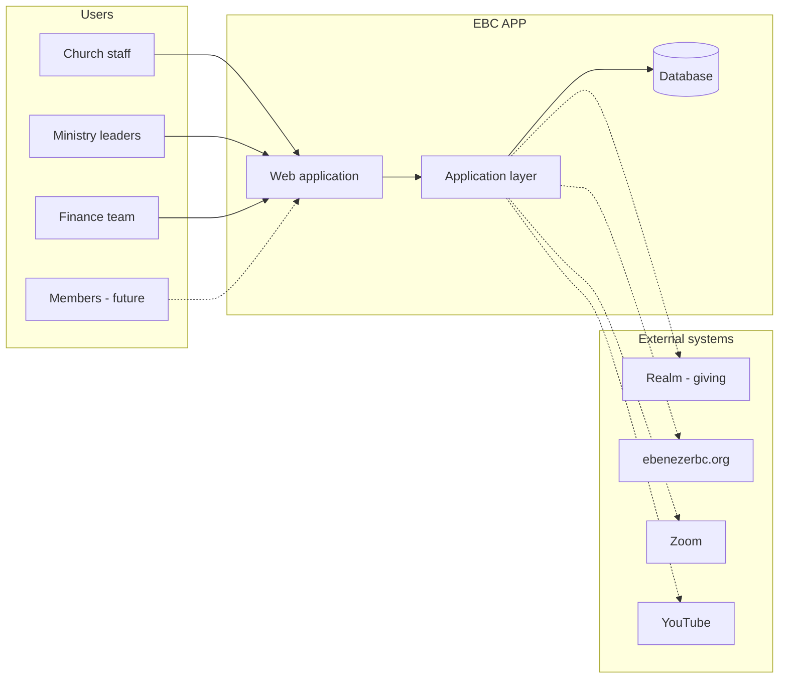
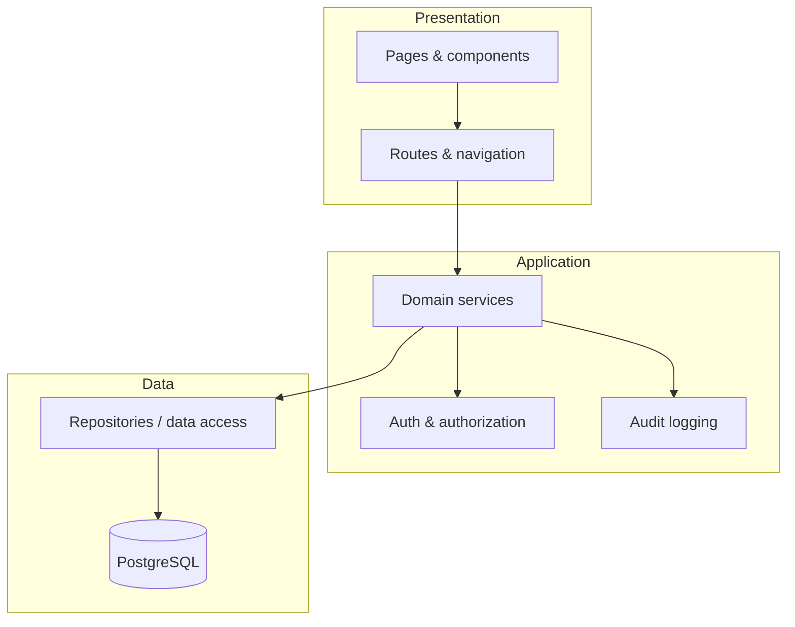

# Architecture Overview

High-level system design for EBC APP.

## System context

EBC APP is an internal church management platform. It sits between church staff/ministry leaders and the data that powers day-to-day operations.

Solid lines are in-scope for initial builds. Dashed lines are integrations planned for later phases.

## Architectural style

**Modular monolith** — one deployable application organized by domain modules that mirror [business operations](../../operations/README.md).

| Choice | Rationale |
|--------|-----------|
| Single application | Appropriate scale for a single congregation; simpler ops and security |
| Domain modules | Clear boundaries per church function (members, events, giving, etc.) |
| Shared database | One source of truth; transactional consistency across modules |
| Web-first | Staff and leaders work from browsers; mobile-responsive UI |

Revisit if usage grows beyond a single church or requires independent scaling.

## Layers

| Layer | Responsibility |
|-------|----------------|
| **Presentation** | UI, forms, tables, navigation; no business rules |
| **Application** | Workflows, validation, permissions, orchestration |
| **Data** | Persistence, queries, migrations |

Business rules live in the application layer, not in UI components or raw database triggers.

## Domain modules

Each module maps to a business operations area. Modules communicate through explicit service interfaces — not direct cross-module database access.

| Module | Operations source | Primary concerns |
|--------|-------------------|------------------|
| `members` | [members.md](../../operations/members.md) | People, households, membership status |
| `ministries` | [ministries.md](../../operations/ministries.md) | Ministry registry, leadership, participation |
| `events` | [events.md](../../operations/events.md) | Calendar, recurring events, approvals |
| `music` | [music-ministry.md](../../operations/music-ministry.md) | Song catalog, service plans, choir/musician distribution |
| `giving` | [giving.md](../../operations/giving.md) | **Realm integration** — links, summaries; not contribution entry |
| `trustees` | [trustees.md](../../operations/trustees.md) | Board duties, meetings, action items |
| `volunteers` | [volunteers.md](../../operations/volunteers.md) | Roles, schedules, assignments |
| `communications` | [communications.md](../../operations/communications.md) | AI Discover → Execute → Evaluate; announcements; ministry `/ministries/communications-ministry` |
| `social` | [social-media-community.md](../../operations/social-media-community.md) | Accounts, content calendar, suggestions, community event discovery (Communications-owned) |
| `facilities` | [facilities.md](../../operations/facilities.md) | Spaces, reservations, maintenance |

Shared cross-cutting packages: `auth`, `audit`, `notifications`.

## Authentication & authorization

- **Authentication** — Users sign in with church-issued accounts (email-based; method TBD in [stack](../stack.md)).
- **Authorization** — Role-based access control (RBAC) aligned with [governance](../../governance/leadership.md).
- **Sensitive data** — Giving records and pastoral notes require elevated roles; enforced at the application layer on every request.

See [security & privacy standards](../standards/security-and-privacy.md).

## Data principles

1. **Church-owned data** — All production data belongs to Ebenezer; export and backup are first-class concerns.
2. **Audit trail** — Create/update/delete on sensitive records is logged with actor and timestamp.
3. **Soft delete** — Prefer soft deletion for member and financial records unless policy requires hard delete.
4. **No orphan policy** — Business rules in operations docs govern retention; software implements them.
5. **Third parties allowed for sensitive data** — PII and giving may live in vetted vendors (ChMS, auth, giving platform); EBC APP references them by ID where possible. See [sensitive data & third parties](sensitive-data-and-third-parties.md).

## Deployment model

| Environment | Purpose |
|-------------|---------|
| **Local** | Developer machines |
| **Staging** | Pre-release testing with anonymized data |
| **Production** | Live church operations |

Hosting provider TBD — see [stack](../stack.md). Production must use HTTPS, encrypted database connections, and automated backups.

## Non-goals (initial phase)

- Multi-tenant SaaS for other churches
- Native mobile apps (responsive web is sufficient initially)
- Real-time collaboration (Google Docs-style)
- Replacing the public website (ebenezerbc.org) — integrate where useful

## Open decisions

- [ ] Member PII: confirm Realm vs other store — see [Realm integration](../integrations/realm.md)
- [ ] Member-facing portal: separate app surface or role-gated views in one app?
- [ ] Hosting provider and CI/CD pipeline
- [ ] Integration priority: accounting, email, website
