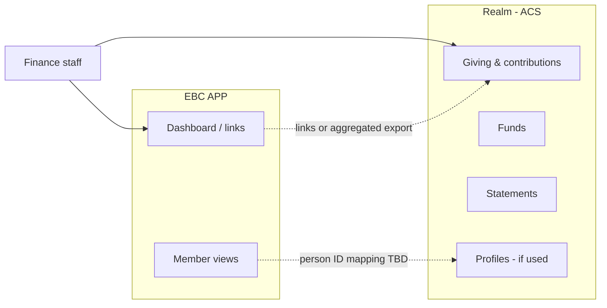

# Realm Integration

[Realm](https://www.acstechnologies.com/realm/) by **ACS Technologies** is Ebenezer's current platform for **giving and stewardship**. EBC APP treats Realm as the **system of record** for contributions, funds, and donor-linked giving data — not a replacement to rebuild.

## What Realm handles today

Based on church use and Realm's stewardship capabilities:

| Capability | In Realm | EBC APP |
|------------|----------|---------|
| Online giving (card, ACH) | ✓ | No — link to Realm / Realm Connect |
| Recurring gifts | ✓ | No |
| Batch entry (cash, checks) | ✓ | No |
| Funds & designations | ✓ | Reference only |
| Individual giving history | ✓ | No duplicate store |
| Giving statements (annual) | ✓ | No |
| Pledges & campaigns | ✓ | TBD — link or summary only |
| Payment card / bank data | ✓ (processor) | **Never** |

Realm may also provide member profiles, groups, events, and accounting if Ebenezer uses additional modules — confirm with finance/office staff. See [open items](#open-items).

## EBC APP giving module scope

**In scope**

- Deep links to Realm for finance staff workflows (reports, batch entry, statements)
- Dashboard **summaries** if available via export or approved integration (totals by fund, period — not donor-level detail unless required and secured)
- Cross-links from member views to Realm person record (if member IDs are mapped)

**Out of scope**

- Recording or editing contributions in EBC APP
- Storing donor giving history in the EBC APP database
- Processing payments

Business process authority: [operations/giving.md](../../operations/giving.md).

## Integration approach

Realm does **not** offer a widely documented public API for custom integrations (unlike ACS MinistryPlatform). Practical options:

| Approach | Use when | Notes |
|----------|----------|-------|
| **Deep links** | Staff need to work in Realm | Lowest effort; EBC APP links to Realm login / relevant screens |
| **Saved reports / export** | Leadership dashboards in EBC APP | Finance exports CSV from Realm on a schedule; EBC APP ingests aggregates only |
| **ACS support** | Deeper integration needed | Contact ACS Technologies about available options for your Realm plan |
| **Manual** | Early phase | Finance continues in Realm; EBC APP documents process only |

Do not build giving features in EBC APP until integration path is confirmed with finance staff and ACS.

## Data boundaries

- **Realm person ID** — If EBC APP maps members to Realm profiles, store only the external ID plus non-sensitive display fields policy allows.
- **No giving amounts in logs** — See [security & privacy](../standards/security-and-privacy.md).
- **Aggregates vs detail** — Prefer fund-level totals in EBC APP; donor-level detail stays in Realm unless a secured, role-gated integration is approved.

## Environment & secrets

When integration is implemented:

| Variable | Purpose |
|----------|---------|
| `REALM_PORTAL_URL` | Base URL for staff deep links (church-specific) |
| TBD | Export paths, API credentials if ACS provides them |

Never commit Realm credentials or giving exports with donor PII to the repository.

## Related Realm products

ACS also offers **Realm Accounting** (general ledger, fund accounting) and **Realm Connect** (congregation mobile app for giving and profiles). Document which products Ebenezer subscribes to in [operations/giving.md](../../operations/giving.md).

## Open items

- [ ] Which Realm modules does Ebenezer use beyond giving? (members, accounting, groups)
- [ ] Realm portal URL and finance staff roles in Realm
- [ ] Whether member profiles in Realm are the directory of record
- [ ] Integration path with ACS (export schedule vs API vs links-only)
- [ ] Who approves showing any giving summary outside Realm
