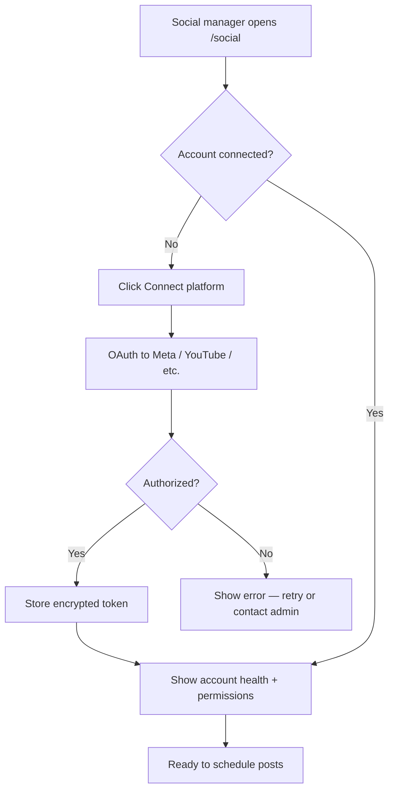
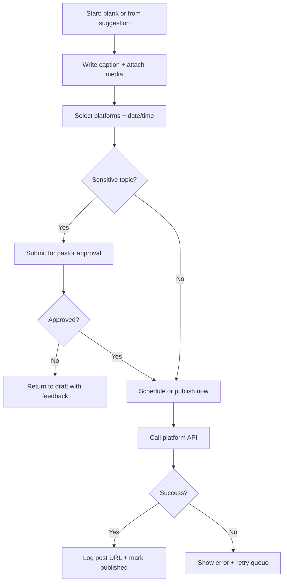
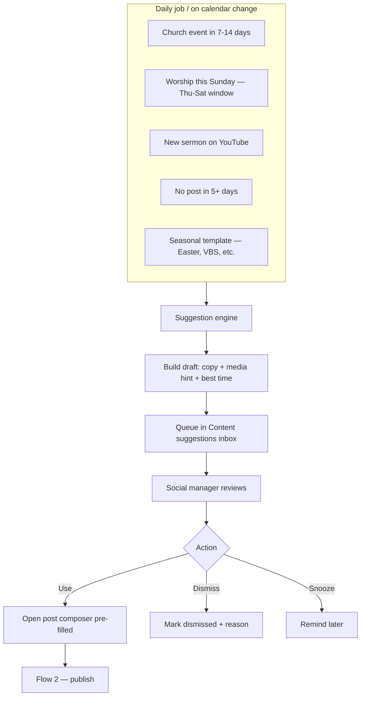
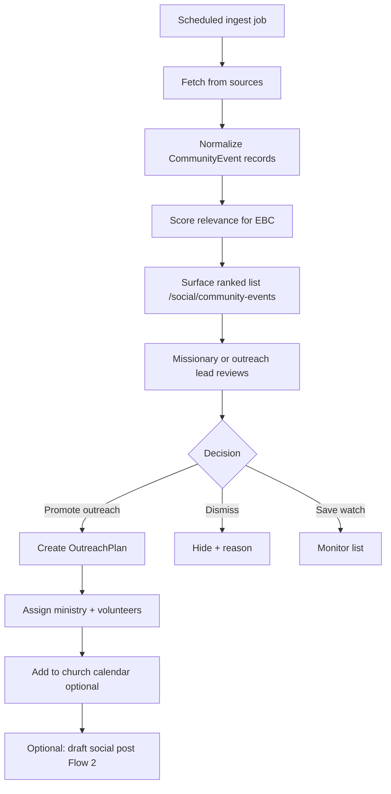
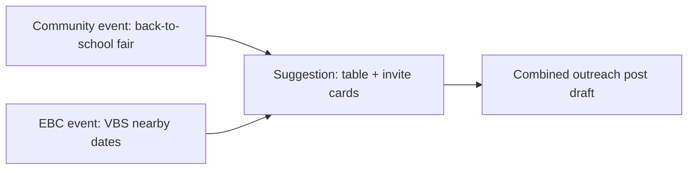

# Social & outreach flows

User and system flows for the `social` module. Pair with individual feature specs.

## Flow 1 — Connect a social account

## Flow 2 — Create and publish a post

**Sensitive topics:** politics, tragedy, doctrine disputes, member photos without release — configurable list.

## Flow 3 — Content suggestions (what to create & when)

Suggestion sources (MVP → later):

| Source | MVP | Later |
|--------|-----|-------|
| EBC [events calendar](../events/church-calendar.md) | ✓ | |
| [Recurring worship](../events/recurring-worship-schedule.md) | ✓ | |
| [Announcements](../communications/announcement-workflow.md) | ✓ | |
| YouTube new upload | | API poll |
| AI copy refinement | | Optional, pastor-approved |

## Flow 4 — Community event discovery → outreach

## Flow 5 — Suggestion → community event link

When a **church** event and **community** event align (same weekend, shared theme):

## Role touchpoints

| Step | Typical role |
|------|----------------|
| Connect accounts | Communications Ministry, admin |
| Review suggestions | Communications (social publisher), Media (assets) |
| Approve sensitive posts | pastor |
| Approve community outreach | missionary lead, pastor |
| Staff event table | missionary volunteers |
