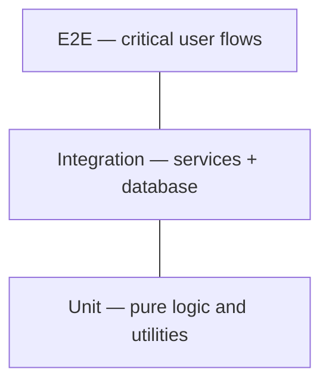

# Testing Standards

How EBC APP is tested — types, expectations, and CI integration.

## Testing pyramid



| Layer | Scope | Speed | Quantity |
|-------|-------|-------|----------|
| **Unit** | Pure functions, validation schemas, utilities | Fast | Many |
| **Integration** | Services, repositories, API routes with test DB | Medium | Moderate |
| **E2E** | Full browser flows for critical paths | Slow | Few |

## What to test

### Always test

- Validation schemas (Zod) — valid and invalid inputs
- Business logic in services — membership transitions, permission checks, giving calculations
- Authorization rules — user without role cannot access protected actions
- Critical e2e flows (once app exists):
  - Staff sign in
  - View member directory (authorized)
  - Record a contribution (finance role)
  - Create a calendar event

### Optional / as needed

- Simple presentational components with no logic
- Third-party library wrappers with no custom behavior

## Test data

- **Never use real member or giving data** in tests or local seed scripts
- Use factories or fixtures with fictional names and amounts
- Seed script `scripts/seed.ts` (future) generates a demo congregation for local dev

## Naming and location

- Co-locate unit tests: `member.service.test.ts` next to `member.service.ts`
- Integration tests: `tests/integration/` or `*.integration.test.ts`
- E2E tests: `tests/e2e/` using Playwright (proposed)

```typescript
describe('MemberService', () => {
  describe('updateMembershipStatus', () => {
    it('allows office staff to move visitor to attender', async () => { ... });
    it('denies ministry leader from changing membership status', async () => { ... });
  });
});
```

## CI pipeline (proposed)

On every pull request to `main`:

1. Install dependencies
2. Lint (ESLint)
3. Typecheck (`tsc --noEmit`)
4. Unit and integration tests
5. Build application
6. E2E tests on main merges or nightly (TBD — balance speed vs coverage)

All steps must pass before merge.

## Coverage

- No hard coverage percentage in early phases
- Aim for **high coverage on services and auth** — where bugs hurt most
- Do not write tests solely to hit a number; test meaningful behavior

## Manual testing

Before a release, verify against a [staging](../architecture/overview.md) environment:

- [ ] Sign in as each role type (admin, office, finance, ministry leader)
- [ ] Confirm unauthorized pages return forbidden, not errors
- [ ] Run one workflow per domain module touched in the release

Document role-specific test accounts in internal runbook (not in public repo).
