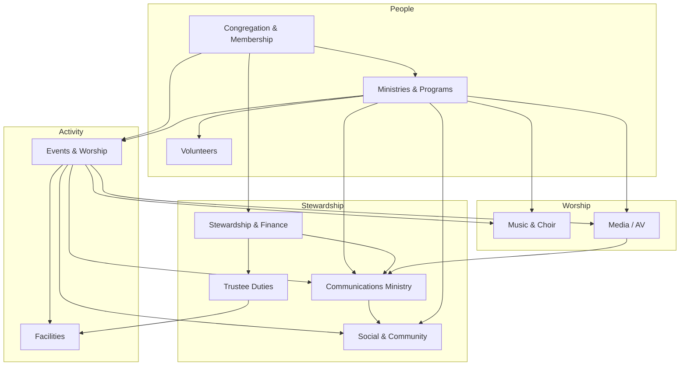

# Church Operations

Functional areas for running Ebenezer Baptist Church day to day. Each document describes **what the church does**, **who owns it**, and **how work flows** — not software features.

## How operations connect

## Operations areas

| Area | Document | Owner |
|------|----------|-------|
| Congregation & membership | [members.md](members.md) | TBD |
| Ministries & programs | [ministries.md](ministries.md) | TBD |
| Events & worship | [events.md](events.md) | TBD |
| Stewardship & finance | [giving.md](giving.md) | TBD |
| Trustee ministry & duties | [trustees.md](trustees.md) | Trustee board (Chair: Tru. Curt Odom) |
| Music & choir | [music-ministry.md](music-ministry.md) | TBD — music director |
| Volunteers | [volunteers.md](volunteers.md) | TBD |
| Communications | [communications.md](communications.md) · [case](../strategy/case-for-communications.md) · [playbook](../strategy/communications-playbook.md) | TBD — pending leadership |
| Social media & community presence | [social-media-community.md](social-media-community.md) | Communications Ministry (social publisher) |
| Facilities | [facilities.md](facilities.md) | TBD |

## Writing standards for operations docs

Each operations document should include:

1. **Purpose** — Why this function exists for the church
2. **Owner** — Role accountable for the area
3. **Key activities** — What happens on a regular basis
4. **Processes** — Step-by-step workflows staff and volunteers follow
5. **Policies** — Rules, approvals, and boundaries
6. **Related areas** — Links to other operations docs
7. **Open items** — Gaps to resolve with leadership

When a process is documented here, engineering can trace [requirements](../engineering/requirements/README.md) back to this source.
